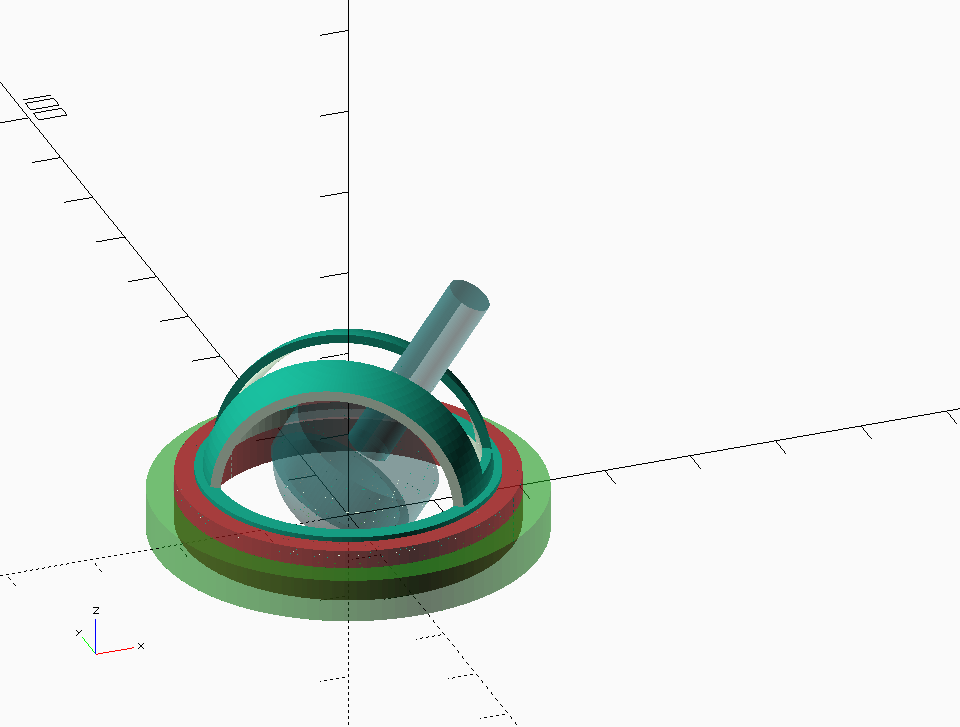

# mush

**Mush is a Usefull Sample Holder**

A smartphone microscope sample holder design!

The idea is to have an easy to handle, orientable sample holder
for the mu-spim.

### Yeah early rendering

CC-BY-SA-NC for now.

&copy; Guillaume Gay 2017.
